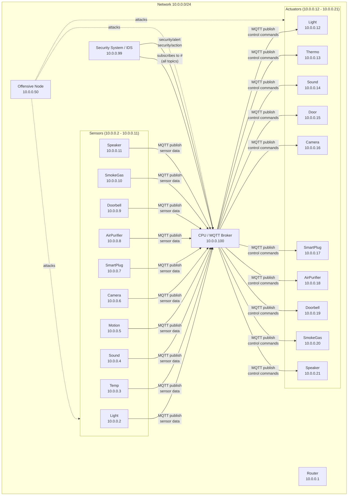
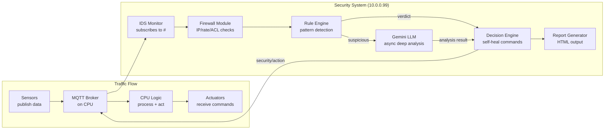

# IoT Network Security & Intrusion Detection System

## Network Topology (GNS3)




## Architecture & Data Flow




## Project Structure

```
iot-cursor/
├── config/
│   ├── network_config.json         # IP assignments, device registry, topology
│   ├── firewall_rules.json         # Whitelist/blacklist IPs, rate limits, port rules
│   ├── detection_rules.json        # IDS thresholds (value ranges, freq limits, ACLs)
│   └── mqtt_topics.json            # Topic-to-device mapping, access control matrix
│
├── security/
│   ├── __init__.py
│   ├── main.py                     # Entry point: wires up all modules, starts IDS
│   ├── firewall.py                 # IP validation, rate limiting, device auth checks
│   ├── ids_monitor.py              # Subscribes to MQTT '#', feeds packets into pipeline
│   ├── rule_engine.py              # Rule-based detection (value/frequency/ACL/payload)
│   ├── llm_analyzer.py             # Async Gemini API calls for deep threat analysis
│   ├── decision_engine.py          # Produces verdicts + self-healing actions for CPU
│   └── utils.py                    # Shared helpers (logging, timestamp formatting)
│
├── reports/
│   ├── report_generator.py         # Builds HTML reports from incident data via Jinja2
│   └── templates/
│       └── incident_report.html    # Jinja2 template: timeline, threats, mitigations
│
├── offensive/
│   ├── attacker.py                 # Main coordinator: menu-driven or automated attacks
│   ├── scanner.py                  # Network/port scanner using raw sockets
│   └── attacks/
│       ├── __init__.py
│       ├── spoofing.py             # Fake sensor data (e.g., temp=999)
│       ├── flooding.py             # MQTT DoS: rapid message flood
│       ├── injection.py            # Direct actuator command injection (bypass CPU)
│       ├── replay.py               # Capture + replay legitimate messages
│       └── malformed.py            # Corrupt/malformed payloads
│
├── devices/
│   ├── cpu.py                      # Modified CPU: security topic handling + self-heal
│   ├── sensor_base.py              # Generic sensor: config-driven, runs on each GNS3 node
│   └── actuator_base.py            # Generic actuator: config-driven, runs on each GNS3 node
│
├── reports_output/                 # Generated HTML incident reports stored here
├── requirements.txt
└── README.md
```

## Detailed Component Design

### 1. Config Files (`config/`)

`**network_config.json**` -- Single source of truth for the entire network:

- Device registry: name, IP, type (sensor/actuator/cpu/security/router), MAC address
- IP ranges: trusted range (10.0.0.1-10.0.0.21, 10.0.0.99, 10.0.0.100), untrusted range
- MQTT broker address and port
- Security system IP, offensive node IP

`**firewall_rules.json**`:

- `allowed_ips`: whitelist of known device IPs
- `blocked_ips`: dynamically updated blacklist
- `rate_limits`: max messages per device per time window (e.g., 20 msgs / 60 sec)
- `allowed_ports`: [1883] (MQTT)

`**detection_rules.json**`:

- Per-sensor value ranges (e.g., temp: -10 to 60, sound: 0 to 120)
- Expected message frequency per device
- Topic-to-device ACL (which device can publish to which topic)
- Payload format rules (expected data types per topic)

`**mqtt_topics.json**`:

- Full topic-to-device mapping (sensor topics, actuator topics, security topics)
- Access control: which client IDs / device types are permitted per topic
- Security topics: `security/alert`, `security/action`, `security/heartbeat`

### 2. Security System (`security/`)

`**ids_monitor.py**` -- the core listener:

- Connects to MQTT broker at 10.0.0.100
- Subscribes to `#` (all topics) to capture every message
- For each message: extracts source info, topic, payload, timestamp
- Passes message through the pipeline: Firewall -> Rule Engine -> (optionally) Gemini -> Decision Engine

`**firewall.py**` -- first line of defense:

- **IP validation**: checks if source is in `allowed_ips` (from config)
- **Rate limiting**: sliding-window counter per device; flags if exceeded
- **Device authentication**: checks MQTT client ID against known devices
- **Port check**: ensures traffic is on expected MQTT port
- Returns: `PASS`, `FLAG`, or `BLOCK` with reason

`**rule_engine.py`** -- pattern-based detection:

- **Value range check**: sensor value outside expected bounds (e.g., temp > 100)
- **Frequency anomaly**: device sending more messages than expected rate
- **Topic ACL violation**: device publishing to a topic it shouldn't (e.g., sensor publishing to actuator control topic)
- **Payload integrity**: malformed data, wrong data type, empty payload
- **Direct actuator access**: non-CPU client publishing to actuator control topics
- **Unknown device**: messages from IPs not in the device registry
- Each rule returns a severity score (0-10) and confidence level
- If total severity > threshold AND confidence is low: forward to Gemini

`**llm_analyzer.py`** -- async Gemini integration:

- Uses `google-generativeai` Python SDK
- Runs analysis in a separate `asyncio` task (non-blocking)
- Sends to Gemini: the suspicious packet (topic, payload, source IP, timestamp), recent message history from the same device, the rule that triggered, device profile from config
- Gemini returns structured JSON: `{ threat_level, threat_type, explanation, recommended_actions, confidence }`
- Results fed into Decision Engine
- API key stored in `.env` file (not committed)

`**decision_engine.py`** -- produces verdicts and self-healing commands:

- Combines rule engine score + Gemini analysis (if any)
- Produces a **verdict**: `SAFE`, `SUSPICIOUS`, `THREAT`
- For `THREAT`: generates self-healing action and publishes to `security/action`:
  - `block_device`: tell CPU to ignore device for N seconds
  - `reset_actuator`: reset actuator to safe default
  - `increase_monitoring`: lower thresholds for device temporarily
  - `network_isolate`: flag device for manual review
- Publishes alert to `security/alert` with full details
- Triggers HTML report generation for each incident

### 3. Modified CPU (`devices/cpu.py`)

Changes to the existing CPU script:

- Subscribe to `security/alert` and `security/action` topics
- Maintain a `blocked_devices` dict (device -> unblock timestamp)
- In `on_message`: check if source device is blocked before processing
- New `handle_security_action()` method:
  - `block_device`: add device to blocked list
  - `reset_actuator`: publish safe default to actuator topic
  - `unblock_device`: remove from blocked list (auto-unblock after timeout)
- Publish `security/cpu_status` periodically so the IDS knows CPU is healthy
- Log all security events with timestamps

### 4. Device Scripts (`devices/sensor_base.py`, `devices/actuator_base.py`)

`**sensor_base.py`** -- single script for all sensors, config-driven:

- Takes command-line args: `--device-name light --ip 10.0.0.2`
- Reads `mqtt_topics.json` to find its publish topic
- Reads `detection_rules.json` to know its normal value ranges
- Publishes realistic simulated data at configurable intervals
- Includes MQTT client ID set to device name (for identification)

`**actuator_base.py`** -- single script for all actuators:

- Takes command-line args: `--device-name light --ip 10.0.0.12`
- Subscribes to its control topic
- Prints received commands, simulates actuator behavior
- Publishes acknowledgment to `home/{name}/ack`

### 5. Offensive Node (`offensive/`)

`**scanner.py`**:

- Scans the 10.0.0.0/24 subnet for active hosts
- Identifies open ports (specifically 1883 for MQTT)
- Fingerprints MQTT broker version
- Reports discovered devices

`**attacker.py`** -- orchestrates attacks:

- Menu-driven or automated sequence mode
- Available attacks:


| Attack           | What it does                                                      | What IDS should detect                 |
| ---------------- | ----------------------------------------------------------------- | -------------------------------------- |
| **Spoofing**     | Publishes fake sensor data (temp=999, sound=500)                  | Value range violation                  |
| **Flooding**     | Sends 100+ msgs/sec to random topics                              | Rate limit exceeded                    |
| **Injection**    | Publishes directly to actuator control topics                     | Topic ACL violation, non-CPU source    |
| **Replay**       | Subscribes, captures msg, replays it rapidly                      | Frequency anomaly, duplicate detection |
| **Malformed**    | Sends corrupt payloads (binary, SQL injection strings, oversized) | Payload integrity failure              |
| **Unauthorized** | Connects with unknown client ID from 10.0.0.50                    | Unknown device alert                   |


### 6. HTML Report Generator (`reports/`)

`**report_generator.py`**:

- Uses Jinja2 to render `incident_report.html`
- Each incident generates a standalone HTML file in `reports_output/`
- Filename format: `incident_{timestamp}_{threat_type}.html`
- Also generates a daily summary report

**Report contents**:

- Header: incident ID, timestamp, severity badge
- Threat details: source IP, target, topic, payload, attack type
- Timeline: packet received -> rule triggered -> LLM analysis (if any) -> decision made -> action taken -> network healed
- Each event in the timeline has a precise timestamp
- LLM analysis section: Gemini's explanation and reasoning
- Mitigation steps: what was done (block, reset, etc.) and what manual steps are recommended
- Network status: before and after self-healing
- Modern, clean styling with inline CSS (no external dependencies)

### 7. Dependencies (`requirements.txt`)

- `paho-mqtt` -- MQTT client library
- `google-generativeai` -- Gemini API SDK
- `jinja2` -- HTML templating
- `python-dotenv` -- Load API keys from .env
- `scapy` -- Packet crafting (offensive node scanning)
- `asyncio` (stdlib) -- Async LLM calls

### 8. Security Topics (MQTT)

- `security/alert` -- IDS -> CPU: threat notification with details
- `security/action` -- IDS -> CPU: self-healing command
- `security/heartbeat` -- IDS -> CPU: periodic health check
- `security/cpu_status` -- CPU -> IDS: CPU acknowledgment and status
- `security/log` -- IDS -> anyone: general event log

## Implementation Order

The build order follows the dependency chain: config first, then devices, then security system, then offensive testing.